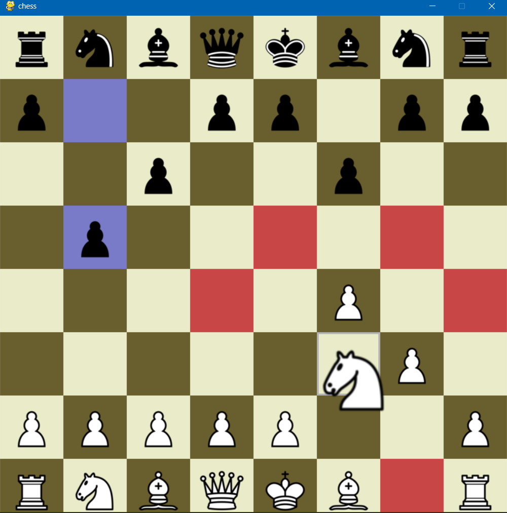
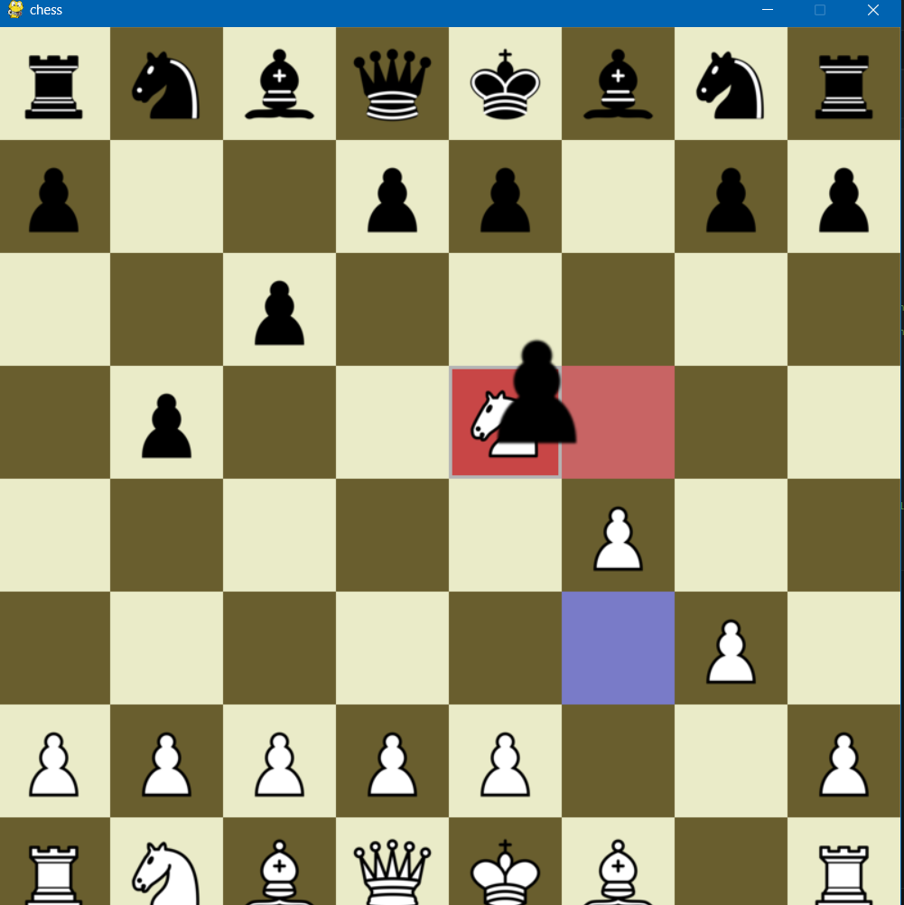
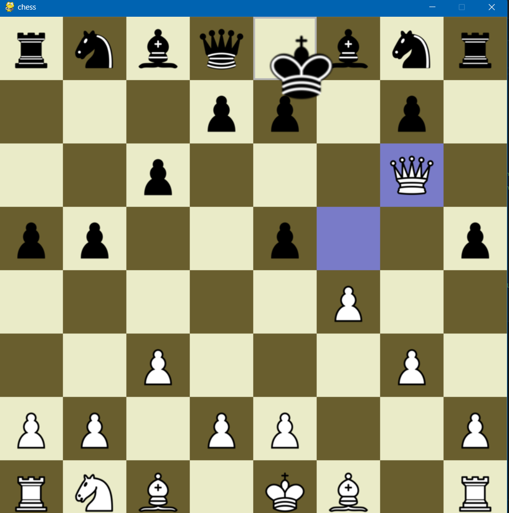

# OFFLINE CHESS GAME USING PYTHON GUI

## Table of Contents
- [About The Project](#about-the-project)
- [Features](#features)
- [Tech Stack](#tech-stack)
- [Getting Started](#getting-started)
- [Screenshots](#screenshots)
- [How To Start](#How-To-Start)
- [Challenges and Solutions](#challenges-and-solutions)
- [Roadmap](#roadmap)
- [Contributing](#contributing)
- [Contact](#contact)
- [Acknowledgments](#acknowledgments)

## About The Project

The Chess App is a real-time platform that allows users to engage in one-to-one chess battles. It facilitates development of strategical thinking in users and immerse them with an efficient and interactive friendly chess experience.

## Features

- Boosts mind and helps in brain development
- Create and play custom chess games to play with friends
- Personalized UI for a good user experience
- Highlighted squares for ease of play for beginners
- Zero lag for efficient playtime

## Tech Stack

- Language: Python
- IDE: Visual Studio Code
- Version Control: Git

## Getting Started

## Screenshots

## How To Start
Install the code and install python and click on main.py to run

## Challenges and Solutions

Challenges that I have faced and how i tackled them:

1. Coding of tricky moves like en passant, capturing, casteling 
   - Solution: Solved with strategical thinking and hit & trail to write proper code for the above moves

2. Blocking of moves during checkmate
   - Solution: Solved by assigning king with the highest value possible and blocking pieces if king is in checkmate 

3. Dragging & release of pieces in different positions
   - Solution: Using arrays and marking filled positions to have only valid moves

4. User Experience
   - Solution: Improved the user experience through UI/UX best practices.

## Roadmap

- Assign pieces to position in GUI and make straight moves, diagonal moves and knight moves
- Introduce rest of the moves like castling, en passent and capturing
- Implement better UI for User Experience
- Optimize performance and add more features based on user feedback

## Contributing

Contributions are welcome! Fork the repository and create a pull request for review.

## Contact

For any queries or support, please feel free to contact me at [chiragverma00310@gmail.com](mailto:chiragverma00310@gmail.com).

## Acknowledgments

I would like to express our gratitude to the open-source community and the developers of the technologies and libraries used in this project. Their valuable contributions have played a significant role in making the Chess App possible.
